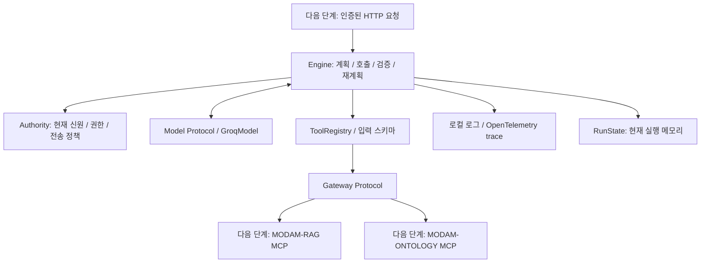

# MODAM-AGI 아키텍처

상태: 첫 기반 묶음 구현. 인증·HTTP·영속화·실제 MCP·승인 실행은 후속이다.

## 현재 실행

1. 검증된 내부 Request를 받는다. subject_ref는 HTTP 입력 계약이 아니라 서버 주입 맥락이다.
2. 현재 활성 신원, 사용자 전송 동의, 서버 전송 정책을 검사한 뒤 Groq에 메시지와 허용 도구 스키마만 보낸다.
3. 전체 계획의 도구/인자를 검사한다. 변경 도구는 이번 묶음에서 실행하지 않는다.
4. 각 호출 직전 업무/범위 권한을 검사하고 신원/추적 맥락을 Gateway에 전달한다.
5. 업무 상태와 근거의 범위·출처·버전·시점·freshness·Cloud 정책을 검사한다.
6. 읽기 일시 장애는 안전한 오류 코드만 모델에 전달해 한도 안에서 재계획한다. 이전 시도의 근거는 버린다.
7. 답변 인용 ID를 실제 근거와 비교하고 반환 직전 현재 권한을 다시 검사한다.
8. 최종 상태와 시간·호출 횟수를 연결된 로컬 로그/트레이스에 기록한다.

## 경계와 제한

- Engine은 사용자 DB/RAG DB/온톨로지 DB에 접근하지 않는다. Authority/Gateway는 다음 단계의 실제 어댑터 경계다.
- DisconnectedGateway는 항상 not_available이다. EvaluationModel/Gateway/Authority는 합성 평가에서만 사용한다.
- 실행 상태는 요청별 메모리다. request_id 멱등성·대화 저장·재시작 복구는 아직 없다.
- 읽기 카탈로그는 rag.search, ontology.objects.get, ontology.paths.query다. 관리자 변경/승인은 후속이다.
- 기본 한도는 모델 경계 4회, 도구 4회, 재계획 1회, 전체 90초, 근거 텍스트 20,000자다. 설정으로 조정한다.
- model_calls는 모델 경계 호출 수다. 실제 Groq 네트워크 시도는 GroqModel.attempts로 별도 기록한다.
- 근거 버전 충돌/중복 ID의 다른 내용은 확인 질문으로 처리한다. freshness를 임의로 current로 만들지 않는다.
- 인용 ID 검증은 모든 답변 사실의 증명이 아니다. 사실 일치는 고정 데이터셋과 실제 모델 평가로 따로 검사한다.
- 로그 저장 실패는 completed를 반환하지 않는다. 현재 로그/트레이스는 프로세스 메모리 및 선택 JSON stream으로 영속 감사 저장소가 아니다.

다음 단계: 내부 인증·PostgreSQL 실행/승인 상태·FastAPI, 이후 실제 MCP 위임·ACL·서비스 통합.
