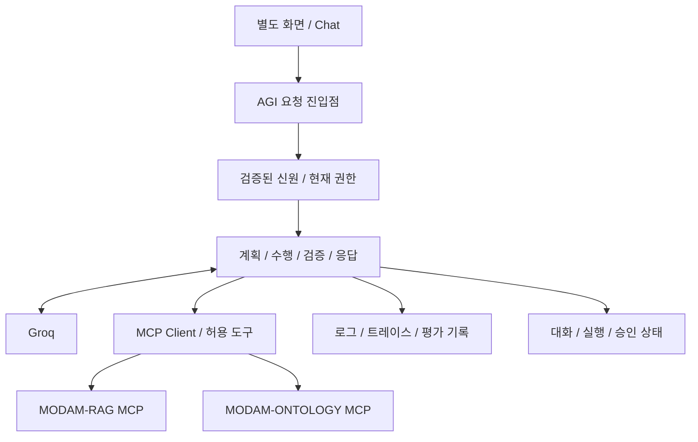

# MODAM-AGI 아키텍처

상태: 승인된 설계 · 구현 미착수. 오케스트레이션 레이어만 담당하며 RAG/온톨로지 구현과 저장소는 별도 서비스다.

## 구성 책임

| 구성 | 책임 |
|---|---|
| 요청 진입점 | 입력 검증, 로그인/신원 연결, 대화 소유권, 응답·오류 계약 |
| 오케스트레이터 | 의도·계획·도구 선택, 호출 한도, 결과 검증, 근거 답변·재계획 |
| Groq 어댑터 | 구조화 모델 입출력, 타임아웃/429/잘못된 JSON 처리, 키·Cloud 전송 관리 |
| MCP Client | 신뢰한 서비스에만 연결, 허용 도구/스키마/버전 검증, 인증·타임아웃·추적 전파 |
| 상태·승인 | 요청 중복, 실행 단계, 승인 스냅샷·결정·재검증, 결과 불명 관리 |
| Evaluation/Observability | 고정 데이터셋·평가 실행, 요청부터 도구까지 연결된 관측 |

RAG의 파일/벡터 색인과 ONTOLOGY의 정의/KG를 AGI DB에 복제해 직접 검색하지 않는다. 근거 참조 ID·버전·시점과 최소 실행 메타데이터를 보관한다. 대화·승인·실행 상태 저장소는 별도 결정한다.

## 실행 경계

1. 인증된 요청과 현재 권한을 확인한다.
2. 전송 허용 여부를 검사한 입력을 Groq로 해석한다.
3. 의도를 검증하고 허용된 MCP 도구만 호출한다.
4. 근거/경로/원천 버전·충돌을 검사하고 필요한 경우 재조회 또는 확인 질문한다.
5. 변경은 별도 승인과 변경 도구의 실제 결과를 확인한다.
6. 최종 상태·근거·시간을 기록한다.

MCP가 스스로 조회 ACL을 검사하고 AGI가 반환/모델 전송 정책을 재검사한다. 모델이 만든 사용자 ID나 권한을 전달하지 않는다. 다중 서비스 호출을 한 DB 트랜잭션으로 간주하지 않는다.

## 실패와 복구

시간 초과·인증 실패·권한 거절·근거 부족·버전 충돌을 구분한다. 읽기 재시도는 호출 예산 내에서 수행한다. 변경 타임아웃은 실패로 단정하지 않고 결과 불명으로 기록한 뒤 idempotency key로 상태를 조회한다. 미연결 도구는 not_available이다.

## 최소 기술 결정

Groq만 확정이다. HTTP 서버·상태 DB·프레임워크는 구현 전 결정한다. MCP 전송은 원격 분리에 적합한 Streamable HTTP를 제안하며 규격 버전·인증·세션/재연결 방식은 계약 테스트로 확정한다. 무인 MCP 접근, 외부 추적 서비스 자동 활성화, 기업 원문 로그 저장은 기본값으로 두지 않는다.
