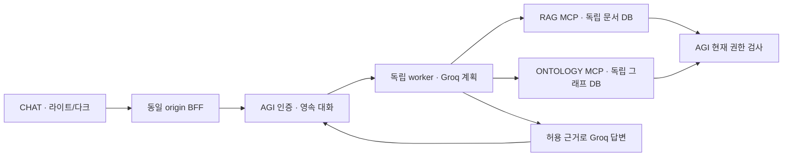

# CHAT ↔ AGI ↔ RAG/ONTOLOGY 구현·검증 · 2026-10-08

사용자가 시나리오 작성 후 구현/테스트/실행을 승인했다. 추가로 사용자가 코드·테스트 리뷰와 검증 통과 후 각 저장소 Git push를 승인했다.
구현 버전: AGI 0.4.0, RAG/ONTOLOGY 0.1.0, CHAT 기존 제공자/API 계약 유지.



## 구현과 시나리오

각 서비스의 docs/SCENARIOS.md에 S01~S08 성공/실패 사례를 먼저 작성하고 실패 테스트 후 구현했다.

- RAG: TXT/텍스트 PDF/XLSX/HWPX 기본 추출·위치·1000자 Chunk, Unicode lexical 검색.
  현재 scope+subject ACL, 원자적 활성 버전 교체, CAS 갱신/삭제, 내용 재적재 충돌을 처리한다.
- ONTOLOGY: 합성 Warehouse/Inventory/Item/ProcurementRule 정의를 명시하고 사람이 검토 기록을
  남긴 승인 버전만 적재한다. 키·필수 속성·자료형·단위·관계 방향/다중성/참조를 검사하고
  오류를 이유별 격리한다. 깊이/개수/ACL 제한을 적용한 outgoing 경로와 원천 버전을 반환한다.
- AGI: 고정 허용 도구 스키마를 유지하고 공식 MCP SDK Streamable HTTP를 호출한다.
  서비스별 HMAC-SHA256 서명 위임은 sub/action/scope/aud/request_id/run_id/trace_id/exp를
  포함한다. 만료는 30초이며 서비스의 live introspection이 현재 grant를 추가로 확인한다.
- CHAT: 기업 조회 모드·자료 범위 입력 안내·근거 ref/버전/시점 표시·기존 일반 대화·다크를 유지한다.
  신규 request_id만 보내고 과거 기업 답변을 새 근거로 재전송하지 않는다.

자료는 서비스 독립 SQLite WAL에 저장하고 CHAT 상태는 기존 PostgreSQL에 둔다.
AGI는 RAG/graph DB에 직접 접근하지 않는다. MCP 관리 도구·ERP 변경은 모델에게 노출하지 않는다.
관리 CLI의 reviewer 문자열은 로컬 관리 기록이며 원격 관리자 인증으로 주장하지 않는다.

## 현재 권한·안전 경계

위임 서명/대상/기간/action → AGI 현재 grant → 서비스 현재 ACL 순으로 검사한다.
검색 후보 및 경로 탐색 전에 ACL을 적용한다. 답변 생성 전후 근거 접근을 다시 검사한다.
저장된 기업 답변은 action/scope와 인용 근거 ref의 현재 ACL/버전을 상태 조회·메시지 복원·SSE/
중복 요청 응답에서 확인한다. 서비스 장애도 보호 답변을 숨기는 방향으로 처리한다.
Admin은 기업 조회 grant를 자동 상속하지 않는다. 기존 사용자 권한을 임의 확대하지 않았다.

읽기 권한과 Cloud 전송 허가는 별개다. cloud_allowed=false 근거는 Groq 답변 생성 전에 차단한다.
원문/위임 토큰/인증 헤더/키/원시 오류는 일반 로그에 남기지 않는다. 서비스 내부 오류는 안전한
MCP 업무 실패로 변환한다. 프론트는 모든 응답을 textContent로 표시한다.

## 검사 증거

| 검사 | 이번 결과 |
|---|---|
| CHAT | npm run check, 74개 테스트, client/BFF 빌드 |
| AGI 단위/계약 | 44개, Ruff/format/mypy strict |
| 실제 3-process HTTP/MCP/SQLite | 2개, 양쪽 서비스 실제 호출·권한 회수·안전한 단절 |
| RAG | 17개, 고정 질문 7/7 기대 사실·실제 PDF/XLSX/HWPX 생성 추출·ACL/갱신/삭제/경쟁 |
| ONTOLOGY | 19개, 객체 10/10·관계 10/10·두 경로·미승인/오류 격리·다중성·ACL/중복 |
| 패키지 | 세 Python 프로젝트 uv sync --frozen, mypy, wheel/sdist 빌드 |
| 기존 AGI 경계 평가 | 합성 14개 × 3회 42/42, 실제 LLM 점수와 구분 |
| 실제 Compose + Groq | 기업 조회 3턴·6메시지, 규정/객체 결합·경로 인용·재시작 후 신규 MCP 재조회 |
| 실제 권한 회수 | 문서 ACL 회수 즉시 기존 기업 답변 숨김, 복구 후 다시 표시 |
| Chromium | 기업 이력/인용·reload·다크 CSS·mobile sidebar·합성 composition·runtime error 0 |

리뷰 보완 후 총 자동 검사 156개. 실제 모델은 Groq openai/gpt-oss-120b, 자료는 합성 fixture다.
모델 대역 통합 테스트 2개와 실제 Groq 3턴을 구분한다. p95/동시 부하/SLA·실제 기업 사실
정확도·Windows/macOS·물리 한글 IME/전체 대비·200% 확대는 이번 통과로 주장하지 않는다.
새 GitHub CI 파일은 정의만 작성했으며 원격 CI 실행은 아직 하지 않았다.

로컬 보고서 .local/reports/knowledge-live.json, knowledge-browser.json, knowledge-browser-dark.png는
Git 제외다. 테스트용 계정은 별도 생성했고 poc-warehouse 합성 범위만 부여했다.
보호된 계정 파일 .local/knowledge-demo-user.json의 값을 Git/보고서에 복사하지 않는다.

## 실행·주소

네 저장소를 같은 부모에 modam-chat/modam-agi/modam-rag/modam-ontology로 배치한다.
기존 CHAT 설정은 scripts/local-chat.py setup으로 준비한다. 독립 지식 서비스는 AGI에서 실행한다.

```bash
uv run python -m modam.knowledge_setup setup
uv run python -m modam.knowledge_setup start
uv run python -m modam.knowledge_setup status
# stop은 서비스를 중지하며 DB volume을 삭제하지 않는다.
uv run python -m modam.knowledge_setup stop
```

setup은 .local/knowledge.env에 서비스별 랜덤 키를 0600으로 생성하고 기존 키를 보존한다.
compose.knowledge.yaml은 base compose.local.yaml 위에 적용하며 독립 rag-data/ontology-data를 추가한다.
클라우드 신뢰 bundle이 필요하면 MODAM_CA_BUNDLE을 지정한다. CA는 build secret/runtime ro mount다.
프록시/검증을 보존하고 내부 service 이름은 NO_PROXY 목록에 한정한다.

현재 UI: http://127.0.0.1:3300 — 이 cloud workspace 내부 주소다. 사용자 PC의 localhost가 아니다.
AGI/RAG/ONTOLOGY/DB는 private Docker network다. 외부 공개 URL은 아직 없다.
터널 API 거절/통신 문제는 별도이며 이번 구현으로 해결됐다고 주장하지 않는다.

## 남은 단계

- RAG: binary HWP/OCR/정확한 복합 표·의미 임베딩/pgvector·Wiki·원격 처리 jobs/관리 MCP.
- ONTOLOGY: 실제 ERP/SAP·별도 매핑 변환/증분·Neo4j/RDF·반자동 후보·원격 관리/작업 관측.
- 공통: 실제 대표 기업 자료 검토, 현재성 정책의 업무별 TTL, SSO·운영 인증/키 회전,
  백업/복원·암호화·서비스 재검사 부하/장애·HA·외부 HTTPS 배포.
- Graph scope는 단일 source의 완전 snapshot이며 여러 시스템의 자동 병합을 하지 않는다.
  근거 ref 테이블/적재 history의 운영 보관·정리 정책은 후속이다.
